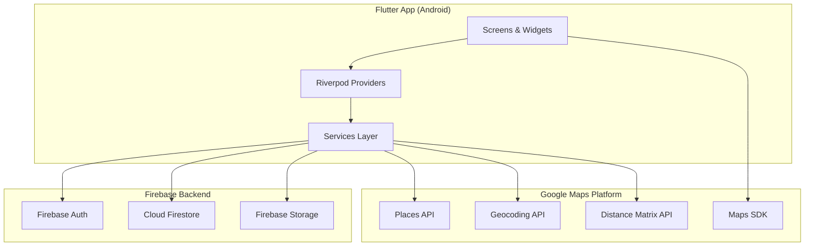

# 🌍 Travel Social Network — MVP Implementation Plan

> **Stack:** Flutter (Android) · Firebase (Auth, Firestore, Storage) · Google Maps Platform  
> **Status:** ⏳ Awaiting approval before coding begins

---

## Table of Contents

1. [Folder Structure](#1-folder-structure)
2. [Firebase / Firestore Database Schema](#2-firebase--firestore-database-schema)
3. [Required Google Cloud API Keys & Services](#3-required-google-cloud-api-keys--services)
4. [Step-by-Step Implementation Plan](#4-step-by-step-implementation-plan)

---

## 1. Folder Structure

```
lib/
├── main.dart                          # App entry-point, Firebase init, router
├── firebase_options.dart              # FlutterFire CLI generated config
│
├── config/
│   ├── theme.dart                     # App-wide ThemeData (colors, typography)
│   ├── routes.dart                    # Named-route definitions (GoRouter)
│   └── constants.dart                 # API keys, collection names, enums
│
├── models/
│   ├── user_model.dart                # AppUser (shared fields + role)
│   ├── business_page_model.dart       # BusinessPage (extra biz details)
│   ├── post_model.dart                # Post / Experience / Event
│   ├── comment_model.dart             # Comment sub-model
│   └── filter_model.dart              # FilterCriteria (location, date range, travel time)
│
├── services/
│   ├── auth_service.dart              # Firebase Auth wrapper (sign-up, login, logout)
│   ├── firestore_service.dart         # Generic Firestore CRUD helpers
│   ├── storage_service.dart           # Firebase Storage upload/download
│   ├── location_service.dart          # Google Maps Geocoding & Places
│   └── distance_service.dart          # Google Distance Matrix API calls
│
├── providers/                         # State management (Riverpod recommended)
│   ├── auth_provider.dart
│   ├── feed_provider.dart
│   ├── post_provider.dart
│   ├── profile_provider.dart
│   └── filter_provider.dart
│
├── screens/
│   ├── auth/
│   │   ├── login_screen.dart
│   │   ├── signup_screen.dart
│   │   └── role_selection_screen.dart
│   │
│   ├── home/
│   │   ├── home_screen.dart           # Feed + filter bar
│   │   └── widgets/
│   │       ├── post_card.dart
│   │       ├── filter_bar.dart
│   │       └── travel_time_picker.dart
│   │
│   ├── post/
│   │   ├── create_post_screen.dart
│   │   ├── post_detail_screen.dart
│   │   └── widgets/
│   │       ├── comment_tile.dart
│   │       ├── like_button.dart
│   │       └── location_picker.dart   # Map + Places autocomplete
│   │
│   ├── profile/
│   │   ├── traveler_profile_screen.dart
│   │   ├── business_page_screen.dart
│   │   └── edit_profile_screen.dart
│   │
│   └── shared/
│       ├── loading_screen.dart
│       └── error_screen.dart
│
├── widgets/                           # Reusable UI components
│   ├── custom_button.dart
│   ├── custom_text_field.dart
│   ├── avatar_widget.dart
│   └── image_picker_widget.dart
│
└── utils/
    ├── validators.dart                # Form-field validators
    ├── date_formatter.dart
    └── geo_utils.dart                 # Lat/Lng helpers, Haversine, etc.
```

### Supporting project-level files

```
android/
├── app/
│   └── src/main/
│       ├── AndroidManifest.xml        # Permissions + Maps API key meta-data
│       └── res/values/strings.xml
│
pubspec.yaml                           # Dependencies listed in Phase 0
firebase.json                          # Firebase project config
firestore.rules                        # Security rules
firestore.indexes.json                 # Composite indexes
```

---

## 2. Firebase / Firestore Database Schema

### 2.1 `users` collection

| Field | Type | Description |
|---|---|---|
| `uid` | `string` | Firebase Auth UID (document ID) |
| `email` | `string` | User email |
| `displayName` | `string` | Full name |
| `photoUrl` | `string?` | Profile photo (Storage URL) |
| `role` | `string` | `"traveler"` or `"business"` |
| `createdAt` | `timestamp` | Account creation |
| `updatedAt` | `timestamp` | Last profile update |

### 2.2 `businessPages` collection

| Field | Type | Description |
|---|---|---|
| `id` | `string` | Auto-generated doc ID |
| `ownerUid` | `string` | FK → `users.uid` |
| `businessName` | `string` | Establishment name |
| `description` | `string` | About the business |
| `category` | `string` | e.g. "Hotel", "Restaurant", "Tour" |
| `address` | `string` | Human-readable address |
| `location` | `geopoint` | Firestore GeoPoint (lat, lng) |
| `phoneNumber` | `string?` | Contact phone |
| `website` | `string?` | Website URL |
| `photoUrls` | `array<string>` | Gallery images (Storage URLs) |
| `createdAt` | `timestamp` | Page creation |
| `updatedAt` | `timestamp` | Last edit |

### 2.3 `posts` collection

| Field | Type | Description |
|---|---|---|
| `id` | `string` | Auto-generated doc ID |
| `authorUid` | `string` | FK → `users.uid` |
| `authorRole` | `string` | `"traveler"` or `"business"` |
| `businessPageId` | `string?` | FK → `businessPages.id` (only if `authorRole == "business"`) |
| `title` | `string` | Post title |
| `description` | `string` | Post body / experience narrative |
| `imageUrl` | `string` | Primary image (Storage URL) |
| `address` | `string` | Human-readable location |
| `location` | `geopoint` | Firestore GeoPoint (precise coordinates) |
| `eventDate` | `timestamp` | Date of the event / experience |
| `likesCount` | `number` | Denormalized like counter |
| `commentsCount` | `number` | Denormalized comment counter |
| `createdAt` | `timestamp` | Post creation |

### 2.4 `posts/{postId}/likes` sub-collection

| Field | Type | Description |
|---|---|---|
| *(doc ID = user UID)* | — | Guarantees one-like-per-user |
| `uid` | `string` | User who liked |
| `createdAt` | `timestamp` | When the like occurred |

> **Why a sub-collection?** Using the user's UID as the document ID makes the "has this user liked?" check an O(1) document read and prevents duplicates at the database level.

### 2.5 `posts/{postId}/comments` sub-collection

| Field | Type | Description |
|---|---|---|
| `id` | `string` | Auto-generated doc ID |
| `authorUid` | `string` | FK → `users.uid` |
| `authorName` | `string` | Denormalized display name |
| `authorPhotoUrl` | `string?` | Denormalized avatar |
| `text` | `string` | Comment body |
| `createdAt` | `timestamp` | Comment creation |

### 2.6 Firestore Indexes Required

```
# firestore.indexes.json (composite indexes)

# Feed: order by date, filter by eventDate range
posts  →  eventDate ASC, createdAt DESC

# Feed: order by creation
posts  →  createdAt DESC
```

### 2.7 Firestore Security Rules (Summary)

```javascript
rules_version = '2';
service cloud.firestore {
  match /databases/{database}/documents {

    // Users — owner read/write, others read-only
    match /users/{uid} {
      allow read: if request.auth != null;
      allow write: if request.auth.uid == uid;
    }

    // Business Pages — owner write, all auth read
    match /businessPages/{pageId} {
      allow read: if request.auth != null;
      allow create: if request.auth != null
                    && request.resource.data.ownerUid == request.auth.uid;
      allow update, delete: if request.auth != null
                            && resource.data.ownerUid == request.auth.uid;
    }

    // Posts — author write, all auth read
    match /posts/{postId} {
      allow read: if request.auth != null;
      allow create: if request.auth != null;
      allow update, delete: if request.auth != null
                            && resource.data.authorUid == request.auth.uid;

      // Likes — one per user, only owner can delete own like
      match /likes/{likeUid} {
        allow read: if request.auth != null;
        allow create: if request.auth.uid == likeUid;
        allow delete: if request.auth.uid == likeUid;
      }

      // Comments — author can edit/delete own, all auth can create
      match /comments/{commentId} {
        allow read: if request.auth != null;
        allow create: if request.auth != null;
        allow update, delete: if request.auth != null
                              && resource.data.authorUid == request.auth.uid;
      }
    }
  }
}
```

---

## 3. Required Google Cloud API Keys & Services

You will need **one** Google Cloud project with the following APIs enabled:

| # | API / Service | Purpose | Where Used |
|---|---|---|---|
| 1 | **Maps SDK for Android** | Embed interactive maps in Flutter | `location_picker.dart`, potential map view |
| 2 | **Places API** | Autocomplete address search, place details | `location_picker.dart` (create post, filter bar) |
| 3 | **Geocoding API** | Convert address ↔ lat/lng coordinates | `location_service.dart` |
| 4 | **Distance Matrix API** | Calculate travel time between two points | `distance_service.dart` (feed filtering) |
| 5 | **Firebase Authentication** | Email/password sign-up & login | `auth_service.dart` |
| 6 | **Cloud Firestore** | NoSQL database | All data persistence |
| 7 | **Firebase Storage** | Image upload (profiles, posts, biz pages) | `storage_service.dart` |

### API Key Configuration

```
# .env (DO NOT commit — add to .gitignore)
GOOGLE_MAPS_API_KEY=AIza...
```

```xml
<!-- android/app/src/main/AndroidManifest.xml -->
<meta-data
    android:name="com.google.android.geo.API_KEY"
    android:value="${GOOGLE_MAPS_API_KEY}" />
```

> [!IMPORTANT]
> Restrict your API key in the Google Cloud Console:
> - **Application restriction:** Android apps (add your package name + SHA-1)
> - **API restriction:** Only the 4 APIs listed above

---

## 4. Step-by-Step Implementation Plan

### Phase 0 — Project Bootstrap & Configuration

| Step | Task | Details |
|---|---|---|
| 0.1 | Create Flutter project | `flutter create --org com.travelsocial travel_social` |
| 0.2 | Add dependencies to `pubspec.yaml` | `firebase_core`, `firebase_auth`, `cloud_firestore`, `firebase_storage`, `google_maps_flutter`, `google_places_flutter` / `flutter_google_places_sdk`, `geolocator`, `image_picker`, `flutter_riverpod`, `go_router`, `intl`, `http`, `flutter_dotenv`, `cached_network_image`, `table_calendar` |
| 0.3 | Configure Firebase | Run `flutterfire configure`, add `google-services.json` to `android/app/` |
| 0.4 | Set up Google Cloud Console | Enable all 4 Maps APIs, create API key, restrict it |
| 0.5 | Add API key to AndroidManifest | See Section 3 above |
| 0.6 | Create folder structure | As defined in Section 1 |
| 0.7 | Deploy Firestore rules + indexes | `firebase deploy --only firestore` |

---

### Phase 1 — Authentication & Role Selection

| Step | Task | Details |
|---|---|---|
| 1.1 | Build `auth_service.dart` | Methods: `signUpWithEmail()`, `signInWithEmail()`, `signOut()`, `currentUser` stream |
| 1.2 | Build `login_screen.dart` | Email + password form, link to sign-up, form validation |
| 1.3 | Build `signup_screen.dart` | Email + password + confirm password form |
| 1.4 | Build `role_selection_screen.dart` | After sign-up → choose Traveler or Business, write role to `users` collection |
| 1.5 | Set up `auth_provider.dart` | Riverpod `StreamProvider` on `authStateChanges`, auto-redirect based on auth state |
| 1.6 | Configure `routes.dart` | Auth guard: unauthenticated → login; authenticated + no role → role selection; else → home |

> [!TIP]
> Use a `StreamBuilder` on `auth_provider` in `main.dart` so the app reacts in real-time to login/logout events.

---

### Phase 2 — User Profiles

| Step | Task | Details |
|---|---|---|
| 2.1 | Build `user_model.dart` | `fromFirestore()`, `toFirestore()`, includes `role` field |
| 2.2 | Build `storage_service.dart` | `uploadProfilePhoto(File)` → returns download URL |
| 2.3 | Build `traveler_profile_screen.dart` | Display name, photo, edit button, list of user's posts |
| 2.4 | Build `edit_profile_screen.dart` | Edit name + photo (image_picker → upload → update Firestore) |
| 2.5 | Build `business_page_model.dart` | Model with all business fields |
| 2.6 | Build `business_page_screen.dart` | Full business page view: gallery carousel, description, contact, map pin, linked posts |
| 2.7 | Create / Edit Business Page flow | Form for business users to fill in their page details + photo gallery upload |

---

### Phase 3 — Post Creation with Location

| Step | Task | Details |
|---|---|---|
| 3.1 | Build `post_model.dart` | Full model with GeoPoint, serialization |
| 3.2 | Build `location_service.dart` | `searchPlaces(query)` → Places API autocomplete; `getPlaceDetails(placeId)` → coordinates; `reverseGeocode(lat, lng)` → address |
| 3.3 | Build `location_picker.dart` widget | Google Maps widget + Places autocomplete search bar; user taps map or searches → fills location fields |
| 3.4 | Build `create_post_screen.dart` | Form: title, description, image (image_picker), location (location_picker), event date (date picker). On submit → upload image to Storage → save post doc to Firestore |
| 3.5 | Handle Business post linking | If `currentUser.role == "business"` → auto-attach `businessPageId` to the post document |

---

### Phase 4 — Home Feed & Post Detail

| Step | Task | Details |
|---|---|---|
| 4.1 | Build `feed_provider.dart` | Query `posts` collection ordered by `createdAt DESC`, paginate with Firestore `startAfterDocument` |
| 4.2 | Build `post_card.dart` | Card widget: image, title, author name, location, event date, like count, comment count. Tap → navigate to detail |
| 4.3 | Build `home_screen.dart` | `ListView.builder` with pull-to-refresh, FAB to create post |
| 4.4 | Build `post_detail_screen.dart` | Full image, all text fields, embedded map showing pin, like button, comments list, add comment input |

---

### Phase 5 — Likes & Comments

| Step | Task | Details |
|---|---|---|
| 5.1 | Build `like_button.dart` | On tap: check if `/posts/{id}/likes/{myUid}` exists. If no → create doc + increment `likesCount` (use `FieldValue.increment(1)` in a batch write). If yes → delete doc + decrement. Show filled/unfilled heart |
| 5.2 | Build `comment_tile.dart` | Avatar + author name + text + timestamp |
| 5.3 | Add comment input in `post_detail_screen.dart` | Text field + send button → write to `/posts/{id}/comments` + increment `commentsCount` |
| 5.4 | Stream comments | `StreamBuilder` on `comments` sub-collection ordered by `createdAt ASC` |

> [!NOTE]
> Using **batch writes** for like toggle (set/delete like doc + update counter) ensures atomicity. An alternative is a Cloud Function trigger, but batch writes keep the MVP simpler.

---

### Phase 6 — Advanced Filters (Travel Time + Date)

This is the **core differentiator** of the MVP.

| Step | Task | Details |
|---|---|---|
| 6.1 | Build `filter_model.dart` | Fields: `baseLocation` (GeoPoint), `maxTravelTimeMinutes` (int), `travelMode` (driving/walking/transit), `startDate`, `endDate` |
| 6.2 | Build `filter_bar.dart` | Collapsible bar at top of feed: (a) "Base Location" field with Places autocomplete, (b) travel time slider (15 min → 8 hrs), (c) travel mode toggle, (d) date range via `table_calendar` |
| 6.3 | Build `distance_service.dart` | `getTravelTime(origin, destination, mode)` → calls Google Distance Matrix API → returns duration in seconds |
| 6.4 | Implement filter logic in `feed_provider.dart` | **Strategy (optimized for MVP):** |

#### Filter Strategy (Detail)

```
1. User sets base location + max travel time + optional date range.

2. Client-side pre-filter:
   a. Query Firestore for posts (optionally filtered by eventDate range
      using a compound query: eventDate >= startDate AND eventDate <= endDate).
   b. For each post, compute a rough Haversine distance client-side.
   c. Discard posts that are obviously too far (e.g., > maxTravelTime * 130 km/h
      for driving — a generous upper bound).

3. Batch Distance Matrix call:
   a. Collect remaining post locations (up to 25 destinations per API call).
   b. Call Distance Matrix: origins=[baseLocation], destinations=[post1, post2, ...].
   c. Parse response → keep only posts where duration <= maxTravelTimeMinutes.

4. Display filtered results in the feed, sorted by travel time ascending.
```

> [!WARNING]
> The Distance Matrix API charges per element (origin × destination). To control costs:
> - Always apply the Haversine pre-filter first.
> - Cache results for repeated queries (in-memory or Firestore).
> - Consider setting a daily quota cap in Google Cloud Console.

| Step | Task | Details |
|---|---|---|
| 6.5 | Build `travel_time_picker.dart` | Slider widget with labels ("15 min", "30 min", "1 hr", "2 hrs", "4 hrs", "8 hrs") |
| 6.6 | Integrate `table_calendar` for date filter | Show a calendar modal; user picks single date or date range → updates `filter_provider` |
| 6.7 | Build `filter_provider.dart` | Holds current `FilterCriteria`, triggers feed re-fetch when changed |
| 6.8 | Add travel time badge to `post_card.dart` | When filter is active, show "🚗 23 min" badge on each card |

---

### Phase 7 — Polish & QA

| Step | Task | Details |
|---|---|---|
| 7.1 | Theme & branding | Finalize `theme.dart`: primary/secondary colors, card styles, font (e.g. Google Fonts "Outfit") |
| 7.2 | Loading & error states | Shimmer skeletons for feed, snackbar errors, empty-state illustrations |
| 7.3 | Image caching | `cached_network_image` for all network images |
| 7.4 | Pagination | Implement infinite scroll with Firestore cursors |
| 7.5 | Input validation | All forms: required fields, email format, image size limit |
| 7.6 | Android permissions | Location, camera, storage — request at runtime with `permission_handler` |
| 7.7 | Testing | Unit tests for services, widget tests for key screens |
| 7.8 | Build & sign APK | `flutter build apk --release` |

---

## Dependency Summary (`pubspec.yaml`)

```yaml
dependencies:
  flutter:
    sdk: flutter

  # Firebase
  firebase_core: ^3.12.1
  firebase_auth: ^5.5.2
  cloud_firestore: ^5.6.6
  firebase_storage: ^12.4.5

  # Google Maps & Location
  google_maps_flutter: ^2.12.1
  geolocator: ^13.0.2
  geocoding: ^3.0.0
  http: ^1.3.0               # For Distance Matrix REST calls

  # State Management
  flutter_riverpod: ^2.6.1

  # Routing
  go_router: ^14.8.1

  # UI & UX
  image_picker: ^1.1.2
  cached_network_image: ^3.4.1
  table_calendar: ^3.2.0
  shimmer: ^3.0.0
  google_fonts: ^6.2.1

  # Utilities
  flutter_dotenv: ^5.2.1
  intl: ^0.20.2
  uuid: ^4.5.1
  permission_handler: ^11.4.0
```

---

## Architecture Diagram



---

## Estimated Timeline

| Phase | Effort |
|---|---|
| Phase 0 — Bootstrap | ~0.5 day |
| Phase 1 — Auth | ~1 day |
| Phase 2 — Profiles | ~1.5 days |
| Phase 3 — Post Creation | ~1.5 days |
| Phase 4 — Feed & Detail | ~1 day |
| Phase 5 — Likes & Comments | ~1 day |
| Phase 6 — Advanced Filters | ~2 days |
| Phase 7 — Polish & QA | ~1.5 days |
| **Total** | **~10 days** |

---

> [!IMPORTANT]
> **Next step:** Please review this plan and let me know if you'd like any changes to the schema, folder structure, feature scope, or implementation approach. Once approved, I'll begin coding Phase 0.
